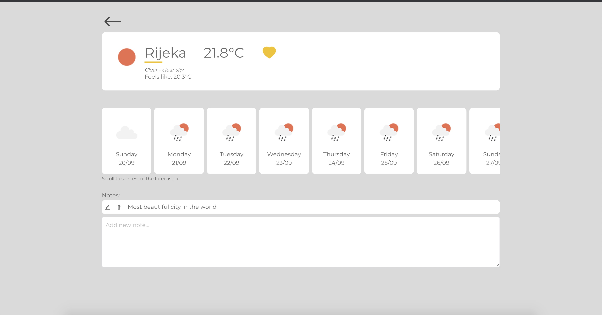
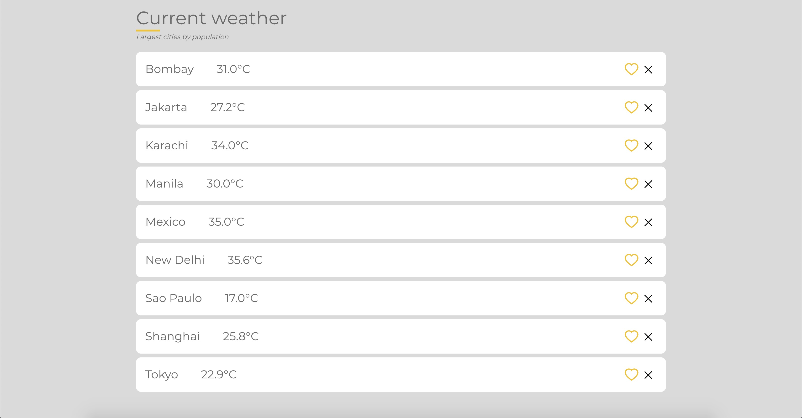
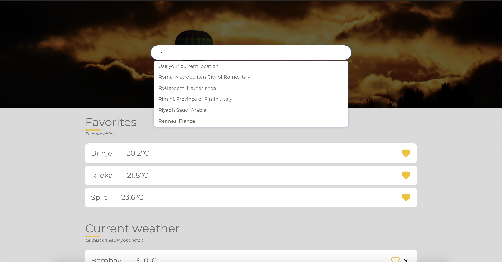
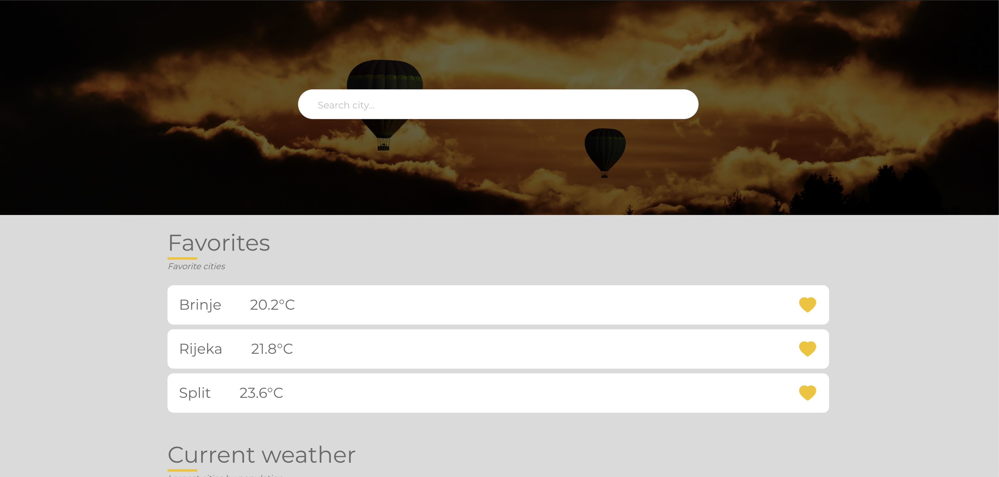

# Weather APP

App with weather information for 15 largest cities. Add your city to favorites, or any other.

## Features

- **TypeScript**
  TypeScript is a typed superset of JavaScript. It has become popular recently in applications due to the benefits it can bring. Typescript is the key to scalability. Build self-documented code, easy-to-debug code and create maintainable large applications and code bases with a highly productive development experience.
- **TSLint + Prettier**
  TypeScript is a typed superset of JavaScript. It has become popular recently in applications due to the benefits it can bring.
- **Redux - state management**
  Redux is a predictable state container for JavaScript apps. It helps you write applications that behave consistently, run in different environments (client, server, and native), and are easy to test.
- **Testing - Jest, Enzyme**
- **Routing - react-router-dom**
  Routing package that became a standard use in combination with react web applications.

## Project structure

```
├── public
├── src
│   ├── core
│   ├── library
│   ├── resources
│   ├── screens
│   │   ├── Home
│   │   ├── Login
│   │   └── Weather
│   │       ├── index.ts
│   │       ├── Weather.action.ts
│   │       ├── Weather.component.ts
│   │       ├── Weather.container.ts
│   │       ├── Weather.reducer.ts
│   │       ├── Weather.style.scss
│   │       └── Weather.type.ts
│   ├── App.tsx
│   ├── index.scss
│   ├── index.tsx
│   ├── react-app-end.d.ts.tsx
│   ├── serviceWorker.ts
│   └── setupTests.ts
├── .env
├── .env.dev
├── .env.prod
├── .env.test
├── .gitignore
├── .prettierrc
├── package.json
├── README.md
├── RULEBOOK.md
├── tsconfig.json
├── tslint.json
└── yarn.lock
```

[Link to RULEBOOK](RULEBOOK.md) - basic rules and branching strategy for frontend application (React or similar to React Native)

### Installation

Navigate to your project root folder and run the following command:

```yarn
yarn install
```

### Run the app

```yarn
yarn start
```

**Hint:**
No need to enter credentials to enter the app, just click on login button.

### Build the app

```yarn
yarn build:dev
```

Suffix :dev can be changed to other, accordingly to needed .env variable

### Testing

```yarn
yarn test
yarn test:watch
yarn test:cov
```

### Deploy

```yarn
firebase login
firebase deploy
```

### Screenshots





